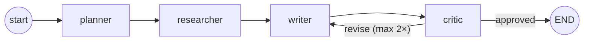

# Agent Mesh

Lightweight TypeScript framework for orchestrating multi-agent LLM workflows
as an explicit, typed graph — with compile-time validation, execution
tracing, and a provider-agnostic core.

[](https://github.com/Pedro-G-B-Azevedo/agent-mesh/actions/workflows/ci.yml)
[](LICENSE)


## Why

Most multi-agent code hides "what happens next" inside each agent's own
logic — hard to visualize, hard to test in isolation, hard to reason about
as a whole. Agent Mesh separates the two concerns: **nodes** only implement
business logic (they receive state, return a partial update), and the
**graph** declares the topology (edges, conditional branches) separately.
That split is what makes a graph's shape drawable *before* it ever runs, and
its actual execution path traceable *after*.

## What it looks like

The included example — 4 agents that plan, research, write, and critique a
short report, looping back for revisions when the critic isn't satisfied:



Real output from `npm run example:research` (see [examples/research-assistant](examples/research-assistant)):

```
Tema: O impacto de agentes de IA autônomos no mercado de trabalho de TI

--- Trace de execução ---
  planner    10605ms
  researcher 21956ms
  writer     9303ms
  critic     8613ms
  writer     10207ms
  critic     6629ms
  writer     10224ms
  critic     7506ms

Total de passos: 8, revisões: 2
```

The critic sent the draft back to the writer twice before converging — the
trace above is the graph's actual decisions on a real run, not a mock.

`invoke()`'s result feeds straight into `renderTraceHtml()`, which draws the
full graph and highlights exactly the path (and, for loops, how many times
each edge was crossed) a specific run took — no setup needed to see it:
open [examples/research-assistant/sample-trace.html](examples/research-assistant/sample-trace.html),
a real committed output from an actual run.

## Features

- **Explicit topology** — `addNode`, `addEdge`, `addConditionalEdge` declare
  the graph up front; a node's own code never decides what runs next.
- **Compile-time validation** — a missing entry point, a dangling edge, or a
  node with no outgoing edge fails at `.compile()` with a message pointing
  at the exact node, not at some unrelated point during a run.
- **Execution tracing** — every run returns the full sequence of
  node/input/output/duration, so a graph's actual path is inspectable, not
  just its shape.
- **Trace visualization** — `renderTraceHtml()` turns a `describe()` +
  `invoke()` result into a self-contained, dark-mode-aware HTML file: the
  static graph, with the run's real path highlighted on top of it.
- **Loop-safety by construction** — a hard `maxSteps` ceiling means a buggy
  conditional edge fails loudly instead of hanging the process.
- **Provider-agnostic core** — the graph and executor depend only on a
  minimal `LLMClient` interface. The included Gemini adapter lives in
  `examples/`, not `src/`, so installing the library never forces a specific
  provider's SDK on you.
- **Strict TypeScript** — `strict`, `noUncheckedIndexedAccess`,
  `exactOptionalPropertyTypes` all on; state updates are typed end to end.

## Quick start

```bash
npm install agent-mesh
```

```ts
import { AgentGraph, END, createMockLLM } from "agent-mesh";

interface CounterState extends Record<string, unknown> {
  count: number;
}

const graph = new AgentGraph<CounterState>()
  .addNode("increment", (state) => ({ count: state.count + 1 }))
  .addEdge("increment", END)
  .setEntryPoint("increment")
  .compile();

const result = await graph.invoke({ count: 0 }, { llm: createMockLLM(["unused"]) });
console.log(result.finalState); // { count: 1 }
```

No LLM call happens in this example — `createMockLLM` is a zero-cost stand-in
for anywhere a node needs `ctx.llm`. See
[examples/research-assistant](examples/research-assistant) for a real graph
that calls the Gemini API through a provider adapter implementing the same
`LLMClient` interface.

## Project structure

```
src/
├── constants.ts     # END sentinel
├── types.ts          # LLMClient, NodeHandler, Router, TraceStep, ...
├── graph.ts           # AgentGraph — mutable builder + compile() validation
├── executor.ts         # CompiledGraph — runs a validated graph, records trace
├── errors.ts            # AgentMeshError (carries the trace so far)
├── llm/mock-llm.ts       # deterministic LLMClient for tests/examples
├── visualize/             # layout + SVG/HTML rendering for a trace
└── *.test.ts                # 19 tests covering validation + execution + rendering

examples/research-assistant/
├── state.ts          # ResearchState shape
├── agents.ts           # planner / researcher / writer / critic node handlers
├── graph.ts              # wires the 4 nodes + the revise/approve conditional edge
├── gemini-client.ts        # LLMClient implementation backed by @google/genai
└── run.ts                    # CLI entry point
```

## Development

```bash
npm install
npm test               # vitest
npm run lint            # eslint
npm run build             # tsup → dist/ (ESM + CJS + .d.ts)
npm run typecheck:examples # type-checks examples/ against real SDK types, no network calls
npm run example:research   # runs the real 4-agent example (needs a Gemini API key, see its README)
```

## Roadmap

- [x] Execution-trace visualizer (render the static graph + highlight the
      path an actual run took)
- [ ] A second provider adapter (Claude) to demonstrate swapping
      `LLMClient` implementations without touching graph/agent code
- [ ] Publish to npm

## License

MIT — see [LICENSE](LICENSE).
